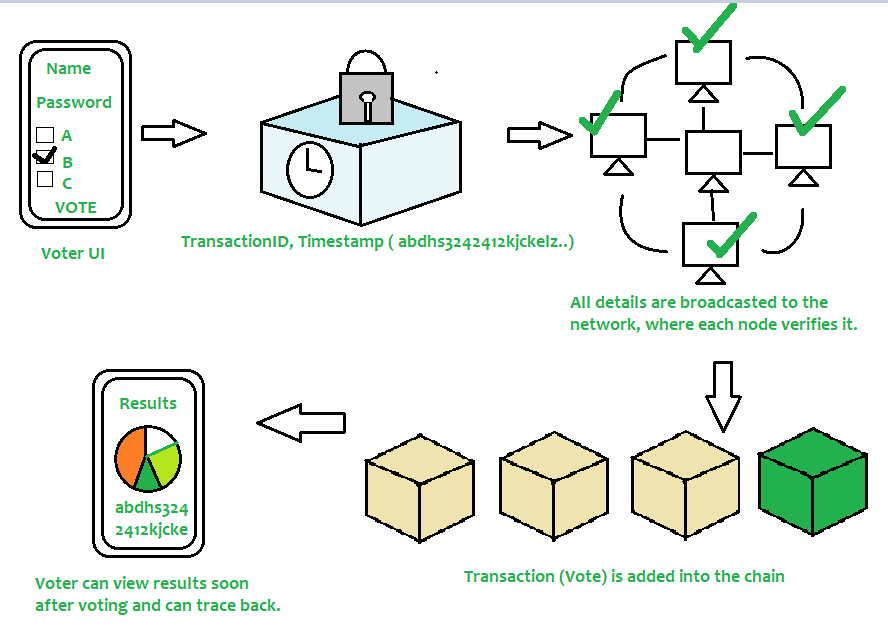
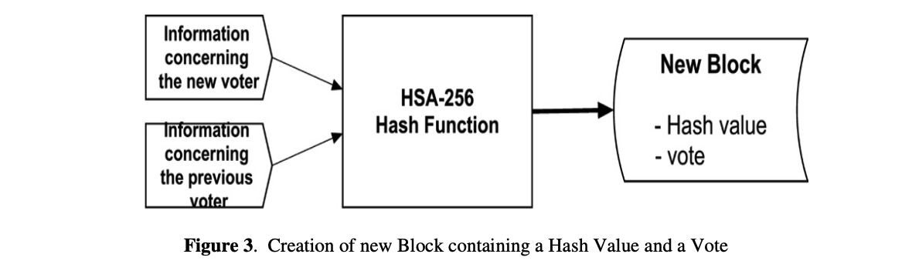
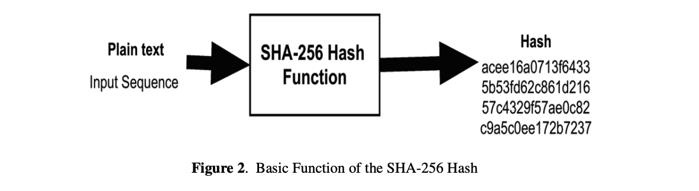
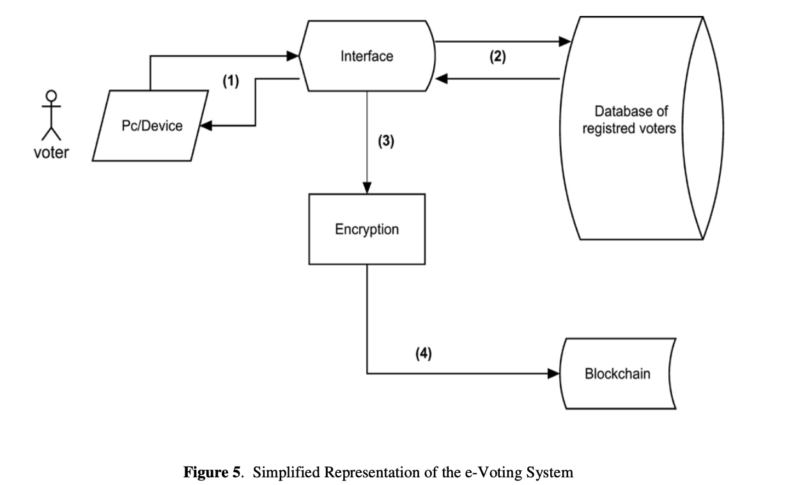

# VoteChain - A Blockchain-Based Voting System

## 📌 Overview
VoteChain is a **decentralized, secure, and transparent** blockchain-based voting system designed to eliminate electoral fraud and enhance voter trust. By leveraging blockchain and smart contracts, it ensures that every vote is **immutable, anonymous, and verifiable**, making elections fair and tamper-proof. 

## 🎯 Problem Statement
Traditional voting systems suffer from **lack of transparency, security vulnerabilities, and potential fraud**, leading to public mistrust. There is a need for a **tamper-proof, verifiable, and decentralized** solution to ensure fair elections.

## 🏆 Solution Approach
VoteChain utilizes **blockchain technology** to create a **transparent and secure** voting system. The solution consists of multiple layers, each playing a crucial role in ensuring **seamless and fraud-resistant** elections:

- **Frontend (React.js):** A user-friendly interface for voters to register, authenticate, and cast votes securely.
- **Backend (Node.js, Express.js):** Handles user authentication, data validation, and communication with the blockchain network.
- **Blockchain Layer (Ethereum, Smart Contracts - Solidity):** Ensures votes are securely stored and immutable on the blockchain.
- **Database (MongoDB/IPFS):** Stores voter registration data securely while keeping ballots on-chain.

## 🏗️ Project Architecture
```
📂 VoteChain
 ├── frontend/          # React.js for UI
 ├── backend/           # Node.js & Express.js
 ├── blockchain/        # Ethereum Smart Contracts
 ├── database/          # MongoDB/IPFS for storing data
 ├── README.md          # Project documentation
```


## ⚙️ Tech Stack
| Layer         | Technology Used |
|--------------|----------------|
| Frontend     | React.js, Tailwind CSS |
| Backend      | Node.js, Express.js |
| Blockchain   | Ethereum, Solidity, Web3.js |
| Database     | MongoDB/IPFS |
| Deployment   | AWS, IPFS, Docker |


## 🔗 How It Works
1. **User Registration:** Voters register and verify their identity through the frontend.
2. **Blockchain Authentication:** The backend validates voter details and issues a unique **blockchain-based voting token**.
3. **Casting Votes:** Voters securely cast their vote, which is recorded on the **Ethereum blockchain** via smart contracts.
4. **Real-Time Verification:** Votes are immutable and can be verified through the blockchain ledger.
5. **Results Compilation:** The system fetches the stored votes and displays results in a transparent manner.

## 🔒 Security Features
✔ **Immutable Votes:** Stored on the blockchain, preventing manipulation.
✔ **Anonymity:** No personal information is linked to votes.
✔ **Decentralization:** Eliminates a single point of failure.
✔ **End-to-End Encryption:** Ensures vote privacy.

## 🚀 Future Enhancements
- Integrate **Zero-Knowledge Proofs** for enhanced privacy.
- Support for **multi-chain interoperability**.
- Implement **mobile voting** with biometric verification.
- AI-based fraud detection mechanisms.

## 📜 Conclusion
VoteChain **redefines elections** by making them **secure, transparent, and verifiable** using blockchain technology. With an easy-to-use interface, decentralized security, and **tamper-proof** vote storage, it represents the **future of digital democracy**. 🗳️🚀

## ⚙️ Image Refrence
#### 1. WorkFlow 


#### 2. Roadmap For Building Project


#### 3. Enternal WorkFlow


#### 4. Workflow Of Each Block(Understanding of blockchain)


#### 5. Function Work of SHA-256


#### 6. Function Work of SHA-256


#### 7. System Flow / purposed system


#### 8. Structure of blockchain 

